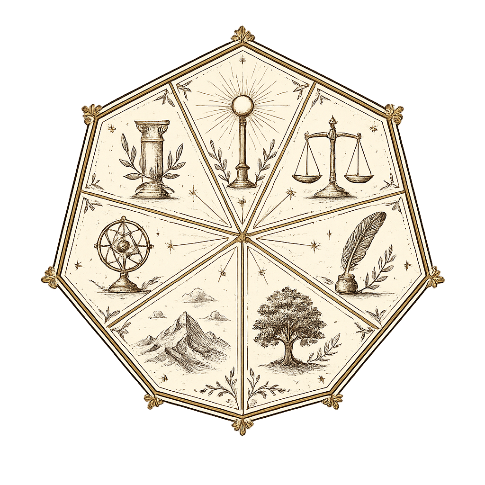

# Éthéria, la Cité des Concepts

  

Bienvenue. Ce wiki suit la création et l'évolution d'un univers-campagne
en cours, alors ne soyez pas surpris si une page change de forme d'une
semaine à l'autre : tout part d'un document de travail qui se réécrit
ici au fur et à mesure que la cité prend corps.

Deux portes d'entrée selon ce qui vous attire :

- [Pitch](monde/presentation.md), pour le ton et les thèmes qui distinguent
  Éthéria d'un décor de fantasy classique.
- [Le monde](monde/introduction.md), pour comprendre pourquoi la
  cité n'apparaît sur aucune carte, et ce qu'on y vient vraiment
  chercher.

Une fois posé, direction les [Quartiers](monde/quartiers/index.md) :
sept zones, sept ambiances, un aperçu de chacune avant d'aller plus
loin. Le menu garde aussi une section Ressources Philo pour creuser
un concept ou un philosophe précis, et une section dédiée au système
de jeu.

> [!MJ] Vous menez la partie ?
> L'Espace MJ regroupe les aventures prêtes à jouer, les conseils de
> mise en scène et les outils de sécurité de table. Il suppose d'avoir
> déjà lu les pages ouvertes aux joueurs, donc mieux vaut garder cette
> porte pour plus tard si vous comptez aussi jouer.
