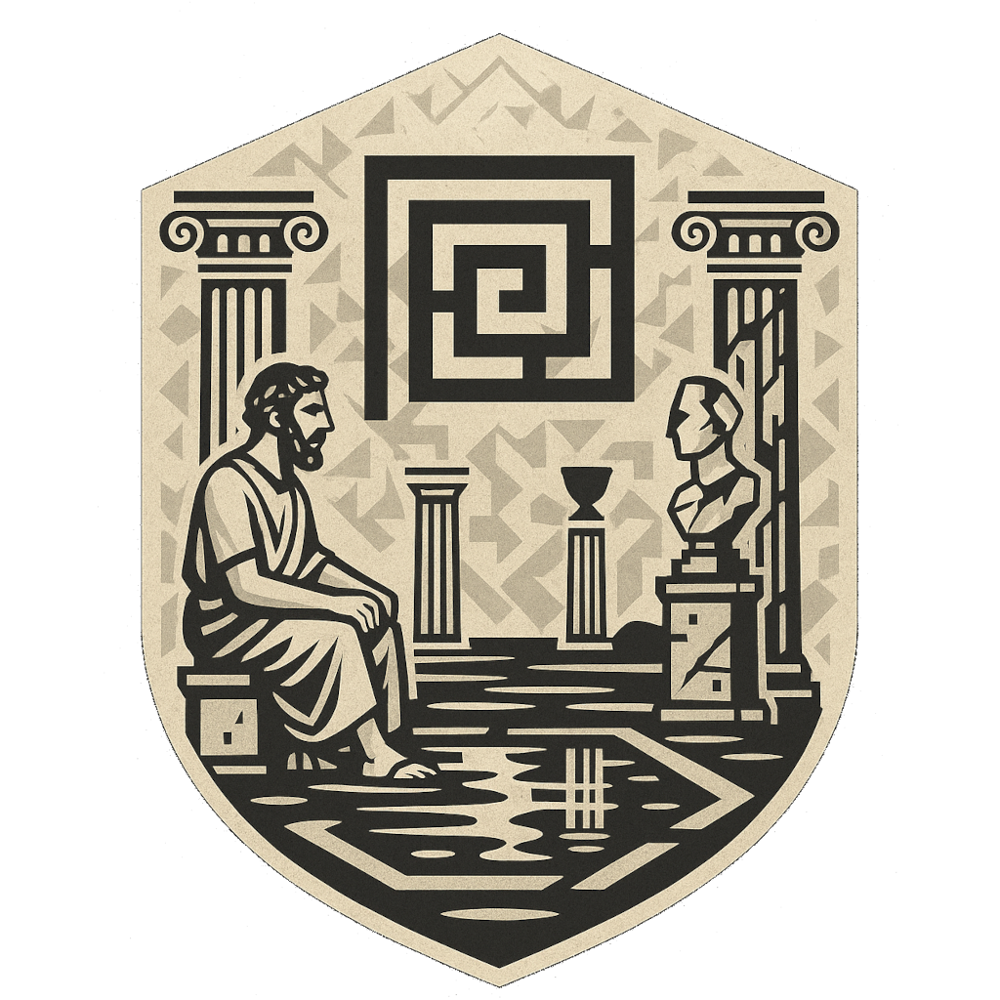
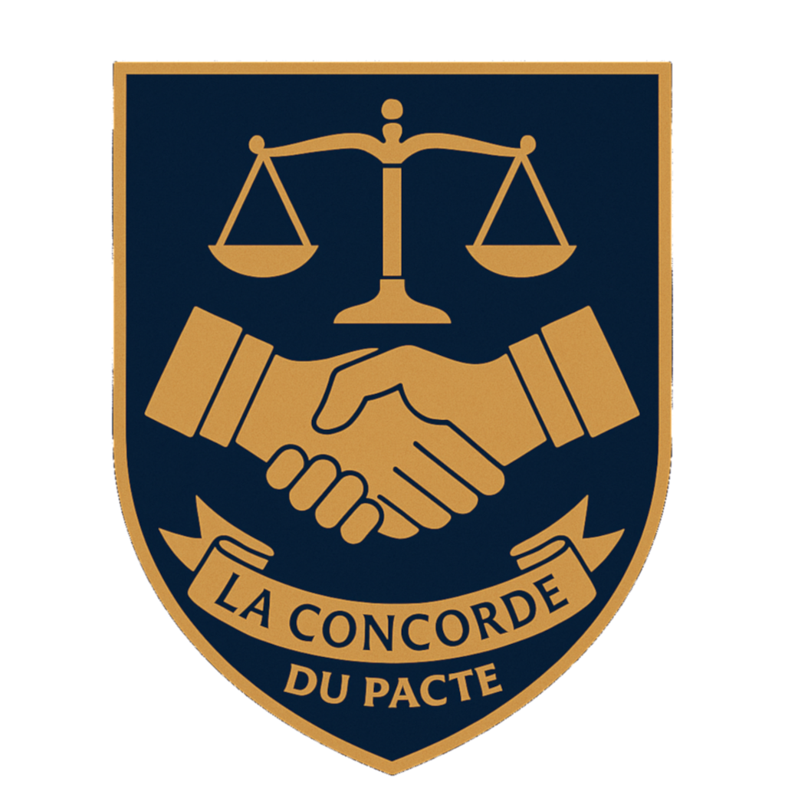
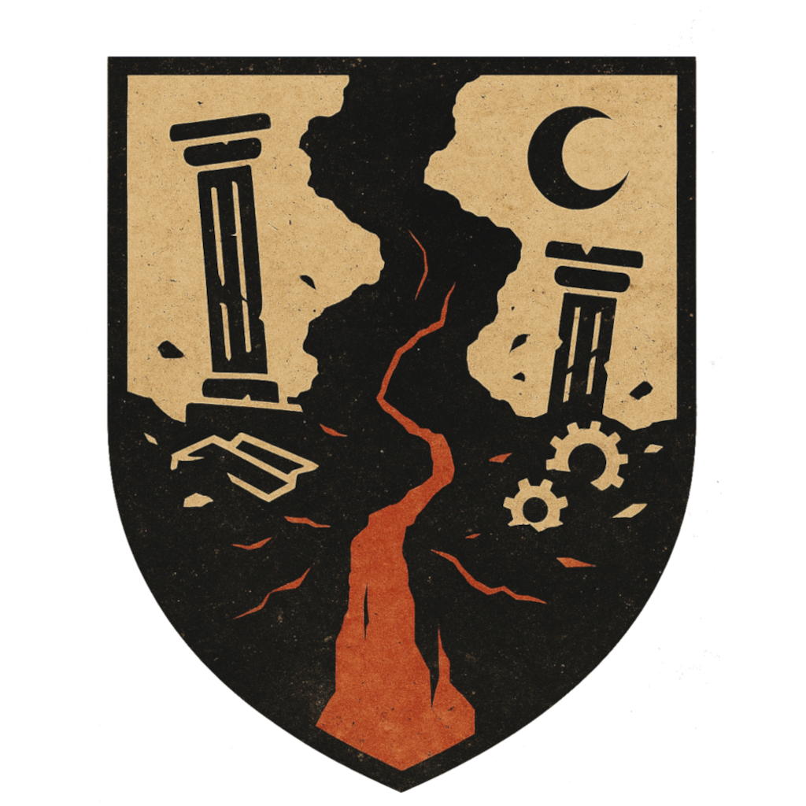
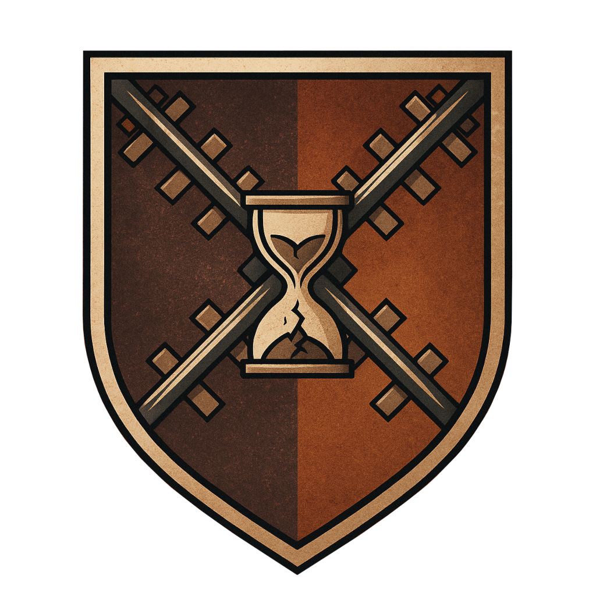

# Vue d'ensemble

Sept quartiers composent Éthéria. Chacun a son atmosphère propre, ses
habitants, ses lieux marquants et ses passages d'accès. Ce qui suit
donne, pour chaque quartier, ce qu'un joueur peut en percevoir en
l'explorant.

> [!MJ] À l'usage du MJ
> Chaque quartier repose sur un concept philosophique précis, détaillé
> dans les callouts `[!MJ]` ci-dessous : la fiche joueur n'y fait
> jamais référence directement. Le principe de la table : les joueurs
> découvrent l'ambiance, les habitants et les dilemmes, pas l'étiquette
> académique qui les sous-tend.

## Le Labyrinthe des Identités

{ width="120" }

Le quartier semble d'abord paisible : colonnades anciennes, fontaines
qui chantent sans s'arrêter, fresques qui bougent si on ne les regarde
pas trop longtemps. Puis le doute s'installe. Une ruelle apparaît là
où il n'y en avait pas hier. Un habitant vous salue par un nom que
vous ne portez pas. Les Rémanents, qui vivent ici, changent
régulièrement de nom et parfois de souvenir ; certains tiennent des
carnets où ils consignent ce qu'ils croient être, au cas où.

> [!MJ] Éléments de jeu
>
> - Concept sous-jacent : le paradoxe identitaire (le bateau de Thésée), déjà traité dans [Plutarque](../resources-philo/sources/plutarque.md).
> - PNJ clés : Théséis (archiviste qui cartographie les transformations du quartier), Naüm (affirme être plusieurs personnes à la fois), la Matrice Ciselée (propose de « refondre » un visiteur contre ses souvenirs).
> - Sortir exige d'abandonner une certitude sur soi. Le Passage du Masque Fendu ne s'ouvre que si le visiteur avoue à voix haute une contradiction intime.
> - Dilemmes types : être jugé pour un acte d'un ancien soi, contester la légitimité de quelqu'un à juger votre identité, la fiabilité douteuse d'un souvenir qu'on voudrait restaurer.
> - Connexions : proche du Gouffre d'Absyr (trouble existentiel partagé, mais rejette son acceptation du non-sens) et de la Citadelle de l'Arété (admirée pour sa constance, jugée rigide).
> - Mythe exploitable : le Premier Fragment, une quête pour reconstituer un « moi entier » à partir de fragments dispersés, ce qui est risqué : plusieurs s'y sont perdus.

## La Concorde du Pacte

{ width="120" }

L'air y est plus clair, les voix mesurées : on y parle avant d'agir.
De vastes forums accueillent des débats permanents, jamais vraiment
clos. Les Liants, qui habitent le quartier, appartiennent chacun à un
Cercle de Délibération ; il n'y a pas d'autorité fixe, seulement des
représentants tirés au sort pour un temps limité.

> [!MJ] Éléments de jeu
>
> - Concept sous-jacent : la légitimité du pacte politique (contrat social), déjà traité dans [Rousseau](../resources-philo/sources/rousseau.md).
> - PNJ clés : Civira (milite pour l'adaptation constante des lois), Magister Halden (légiste obsédé par une « clause parfaite » jamais validée), le Porte-Parole Silencieux (ne fait que relayer les votes de sa communauté).
> - Entrer exige un engagement volontaire à une règle qu'on n'a pas choisie ; les arches de serment ne s'ouvrent qu'après une formule d'adhésion, parfois devant témoin.
> - Dilemmes types : maintenir un contrat injuste pour un tiers non représenté, la validité d'un serment ancien dont le contexte a changé, trancher un débat sans consensus possible.
> - Connexions : tensions avec les Rails de la Décision (jugés trop lents à agir) et le Gouffre d'Absyr (perçu comme une menace à toute coopération) ; affinité avec les Jardins de l'Équité.
> - Mythe exploitable : l'Accord Inattendu, pacte scellé spontanément entre deux factions ennemies ; rumeur d'une Loi Cachée oubliée dans la Constitution Collective.

## La Balance d'Orion

{ width="120" }

Tout y semble pesé, optimisé. Le silence est ponctué de mécanismes
invisibles ; des panneaux affichent en continu des courbes de bien
commun. Sous cette harmonie apparente, un malaise sourd : la douleur
n'est pas absente, seulement répartie avec soin. Les Maximisants, qui
y vivent, tiennent des carnets de conséquences et arbitrent leurs
choix en assemblée.

> [!MJ] Éléments de jeu
>
> - Concept sous-jacent : le calcul utilitariste des conséquences (Bentham, Mill), voir [Sources & auteurs](../resources-philo/sources/index.md).
> - PNJ clés : Éléon Rive (a proposé un barème émotionnel standardisé), Zok (régulateur public, pratique une euthanasie rituelle sur demande), l'Oracle Paradoxal (prédit l'impact à long terme, contre un prix moral).
> - Entrer par choix raisonné (Porte des Conséquences) ; un portail caché, la Passerelle Injuste, exige d'accepter d'infliger une injustice « nécessaire mais temporaire ».
> - Dilemmes types : sacrifier une personne pour en sauver cinq sans détour possible, une minorité invisible lésée par un progrès majoritaire, éliminer par avance un enfant qui deviendrait un tyran.
> - Connexions : tensions avec la Citadelle de l'Arété (jugée trop centrée sur l'intention) et le Gouffre d'Absyr (vu comme une menace irrationnelle à l'équilibre) ; alliance tactique avec la Concorde du Pacte.
> - Mythe exploitable : la Décision de Luhen (sacrifice fondateur dont on ignore s'il fut juste ou simplement utile), le Calcul Ultime (manuscrit interdit, rendrait paralysé moralement).

## Le Gouffre d'Absyr

{ width="120" }

Un brouillard pâle ne se lève jamais tout à fait. Les rues ne mènent
nulle part en particulier, les horloges tournent dans des sens
contraires. On n'y crie pas : on observe, on s'interroge, on renonce,
parfois avec une paix étrange. Les Déliés, qui habitent ici, ont tous
abandonné quelque chose, un but, une foi, une illusion.

> [!MJ] Éléments de jeu
>
> - Concept sous-jacent : l'absurdité de l'existence (Camus, Nietzsche, Kierkegaard), voir [Sources & auteurs](../resources-philo/sources/index.md).
> - PNJ clés : Camüs (veilleur taciturne, collectionne des notes non envoyées), Sœn (poète muet, écrit à l'encre invisible), la Femme au Sable (propose d'oublier non ce qu'on a vécu, mais pourquoi).
> - On n'y entre pas par un chemin : on y tombe, souvent après une rupture intérieure. La Brèche du Rire ne s'ouvre que si l'on rit face à l'absurdité de l'existence.
> - Dilemmes types : continuer une mission qu'on sait sans le moindre sens, mentir à un enfant sur la raison de vivre, tout comprendre sans jamais pouvoir le partager.
> - Connexions : en contradiction radicale avec la Concorde du Pacte et la Balance d'Orion ; affinité trouble avec le Labyrinthe des Identités (instabilité fondamentale partagée).
> - Mythe exploitable : le Silence Originel (un instant où tout le quartier se serait figé), le Clignement de la Cité (des rues qui disparaissent et reviennent changées).

## Les Rails de la Décision

{ width="120" }

Des rails sombres serpentent entre les bâtiments, parfois suspendus
dans le vide. Chaque croisement porte une histoire non résolue ; la
lumière change selon les décisions prises, douce tant que rien n'est
tranché, crue dès qu'on agit. Les Aiguilleurs, formés dès l'enfance à
trancher vite, portent souvent une marque visible de leurs choix
passés.

> [!MJ] Éléments de jeu
>
> - Concept sous-jacent : le dilemme du tramway, décision et responsabilité (Thomson, Foot), voir [Sources & auteurs](../resources-philo/sources/index.md).
> - PNJ clés : Argos l'Indécis (immobile au même carrefour depuis quarante ans), Juma-Kei (conduit un tramway qui n'emprunte que les rails nés de décisions non assumées), le Collecteur (archive tous les choix des visiteurs).
> - Entrer exige une décision explicite ; la Rampe du Premier Choix est une descente irréversible, sans retour en arrière possible.
> - Dilemmes types : un rail mène à la mort d'un proche, l'autre à la souffrance de dizaines d'inconnus, sans détour ; agir contre un mal certain ou s'abstenir face à un mal peut-être pire ; la responsabilité d'un enfant qui actionne un aiguillage par jeu.
> - Connexions : conflit avec la Concorde du Pacte (jugée trop lente) et le Gouffre d'Absyr (nie la valeur même de la décision) ; s'articule avec la Balance d'Orion, dont elle partage le goût de l'action mesurée.
> - Mythe exploitable : le Tramway Immatériel, qui ne tue pas mais efface ceux qui diffèrent trop longtemps un choix fondamental.

## Les Jardins de l'Équité

{ width="120" }

Un calme mesuré y règne : chemins symétriques, fontaines aux bassins
jumeaux, lumière dosée avec soin. On ne s'y presse pas, mais on n'y
stagne pas non plus. Sous cette perfection, une tension sommeille :
toute règle, même juste, laisse des exclus. Les Arbitres, ou
Équilibrés, consacrent leur vie à l'art difficile de la juste
mesure plutôt qu'à l'égalité brute.

> [!MJ] Éléments de jeu
>
> - Concept sous-jacent : la justice distributive et corrective, dans une synthèse entre Aristote, Rawls, Nozick et Sen, voir [Sources & auteurs](../resources-philo/sources/index.md).
> - PNJ clés : Démis Tal (médiateur aveugle, perçoit les déséquilibres à la voix), Lara d'Alve (cartographe des inégalités persistantes), la Juge Silencieuse (ne rend jamais de verdict, mais fait jaillir les aveux par sa seule présence).
> - Entrer exige d'avoir été témoin d'une injustice sans y participer, ou d'avoir plaidé sincèrement pour autrui ; la Grille de la Balance exige de se soumettre au jugement collectif.
> - Dilemmes types : deux voyageurs réclament la même ressource, l'un par besoin, l'autre par mérite ; punir un crime commis pour réparer une injustice, ou en reconnaître la cause ; une réforme qui améliore le bien général mais lèse un petit groupe marginalisé.
> - Connexions : affinité avec la Concorde du Pacte et la Citadelle de l'Arété ; méfiance envers la Balance d'Orion (jugée trop utilitariste) et le Gouffre d'Absyr (nie toute base stable de jugement).
> - Mythe exploitable : le Bambou fendu (réconciliation ancienne entre deux familles), le Jardin Inversé (lieu secret, délibérément injuste, réservé aux plus avancés).

## La Citadelle de l'Arété

{ width="120" }

Un calme profond s'installe à mesure qu'on approche. On n'y court
pas : on y marche avec détermination, observé non pour être jugé,
mais pour être compris à l'aune de sa constance. Bâtie en terrasses,
chaque palier abrite un lieu dédié à une qualité de caractère. Les
Pratiquants, qui y vivent, refusent les masques et cherchent la
cohérence entre pensée, parole et action.

> [!MJ] Éléments de jeu
>
> - Concept sous-jacent : l'éthique de la vertu comme disposition acquise par l'habitude, chez Aristote, prolongée par Thomas d'Aquin et MacIntyre, déjà traité dans [Aristote](../resources-philo/sources/aristote.md).
> - PNJ clés : Eudémos (n'enseigne que par l'exemple), Alea d'Ilion (ancienne voyageuse des sept quartiers, revenue enseigner la constance), la Sentinelle Blanche (ne parle que lorsqu'une vertu est niée trois fois).
> - Entrer exige de reconnaître une faiblesse morale en soi ; le Col de l'Incomplétude est un sentier raide où chaque pas demande une lucidité nouvelle.
> - Dilemmes types : agir courageusement quand on sait l'action inutile, cacher une vérité pour préserver l'estime d'un proche, rester fidèle à ses principes dans un monde qui les bafoue.
> - Connexions : affinité avec les Jardins de l'Équité et la Concorde du Pacte ; méfiance envers la Balance d'Orion (sacrifice de la vertu à l'efficacité) et le Labyrinthe des Identités (jugé trop instable pour un soi stable).
> - Mythe exploitable : la Pierre Non Jetée (colère enterrée, fendue en deux cent ans plus tard, symbole du pardon silencieux), le Chemin des Semblants (où l'on peut imiter toutes les vertus sans les vivre).
