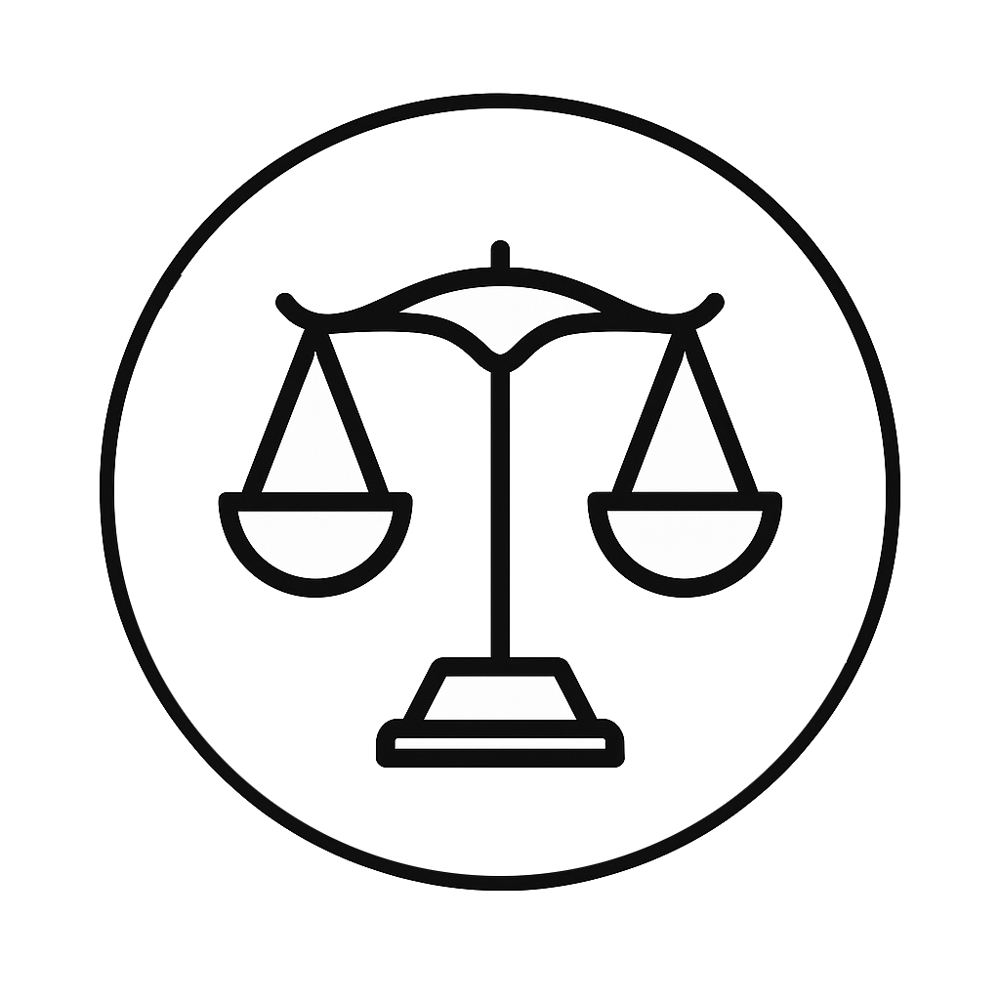

# { width="36" } La Balance d'Orion

> [!REGLE] Concept abordé
> Calcul moral des conséquences. Problématique centrale : une action
> est-elle juste si elle maximise le bonheur, même au détriment de
> certains individus ? Raisonnement conséquentialiste. Concepts
> associés : bonheur, souffrance, majorité, efficacité, calcul moral.

## Philosophes associés

Jeremy Bentham pose le principe d'utilité et une arithmétique du
plaisir. John Stuart Mill y ajoute une hiérarchie des plaisirs, une
dimension qualitative que Bentham n'avait pas prévue. Peter Singer,
plus près de nous, en tire une éthique efficace et une responsabilité
face à la souffrance qu'on pourrait éviter.

> [!MJ] Nuance historique
> Le principe « le plus grand bonheur du plus grand nombre » est
> associé à Bentham par convention, mais la formule circulait déjà
> avant lui, chez Hutcheson notamment, et Bentham s'en est lui-même
> distancié dans ses écrits tardifs. L'attribution reste l'usage
> courant, mais elle simplifie une histoire plus complexe.

## Ce que ça donne en jeu

Ici, tout est pesé, évalué, mis en relation avec les conséquences
attendues. Les rues changent selon les effets anticipés de chaque
décision. Des automates enregistrent les actes, des oracles chiffrent
les souffrances, des balances monumentales pèsent le bonheur
collectif. La logique du plus grand bien y règne, mais à quel prix ?
Les joueurs peuvent devoir choisir entre sauver un groupe nombreux ou
une personne-clé, abandonner une ressource ou un allié pour améliorer
la situation globale, ou constater qu'une solution parfaitement
efficace entraîne malgré tout une perte humaine ou éthique.

Éléon Rive peut mettre ce calcul entre les mains des joueurs
directement, en leur demandant d'évaluer une souffrance à l'aide de
son barème standardisé, un exercice qui tourne vite au malaise dès
qu'il faut chiffrer la douleur d'un proche. Zok illustre la version la
plus radicale de la logique utilitariste, celle de Singer poussée à
son terme : consulté, il ne dissuade jamais, ce qui met les joueurs
face à une responsabilité qu'ils ne peuvent pas déléguer entièrement
au calcul. Quant à l'Oracle Paradoxal, il matérialise le prix que
Mill refusait de payer : chaque prédiction obtenue efface une
possibilité, ce qui rend chaque consultation coûteuse même quand elle
est juste.

## Questions à poser à la table

Le bonheur des uns peut-il justifier la souffrance des autres ?
Est-il légitime de quantifier le bien ? Peut-on sacrifier un individu
pour le bien de tous ? À quel moment l'efficacité devient-elle une
tyrannie ?
