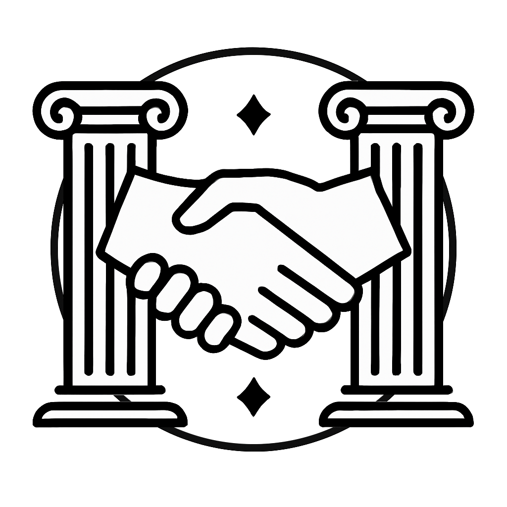

# { width="36" } La Concorde du Pacte

> [!REGLE] Concept abordé
> Légitimité du pouvoir et fondement de l'autorité politique.
> Problématique centrale : pourquoi obéit-on aux lois ? Qu'est-ce qui
> justifie qu'un pouvoir soit reconnu comme légitime ? Raisonnement
> politique, juridique et moral. Concepts associés : consentement,
> souveraineté, devoir civique, pacte implicite.

## Philosophes associés

Thomas Hobbes voit dans le Léviathan le seul garant de l'ordre contre
le chaos naturel. John Locke situe au contraire la légitimité dans le
consentement des gouvernés, avec un droit à la révolte si ce
consentement est trahi. Jean-Jacques Rousseau en fait un pacte
fondateur : la volonté générale comme source d'une liberté
authentique. Rawls, bien plus tard, imagine un contrat hypothétique
fondé sur l'équité, derrière un voile d'ignorance.

## Ce que ça donne en jeu

Ce quartier est ordonné, harmonieux en apparence, mais traversé de
tensions souterraines. On y débat, on y négocie, on y signe. Les lois
y sont visibles, parfois gravées dans la pierre. Pourtant, derrière
chaque édifice légal sommeille une question : sur quoi repose
l'accord qui fonde cette paix apparente ? Les joueurs peuvent se
retrouver à représenter une communauté sans avoir été élus, ou voir
une faction rompre un accord ancien et mettre en péril l'équilibre
entre quartiers. Des textes fondateurs peuvent être remis en
question, avec la possibilité d'y participer directement. Et parfois,
un serment engage moralement tout en risquant de trahir une
conviction profonde.

## Questions à poser à la table

Peut-on être libre en obéissant à des règles ? Un accord tacite
est-il valide s'il n'a jamais été explicitement accepté ? Faut-il
respecter un pacte injuste au nom de la stabilité ? Quand la
désobéissance devient-elle un devoir ?
