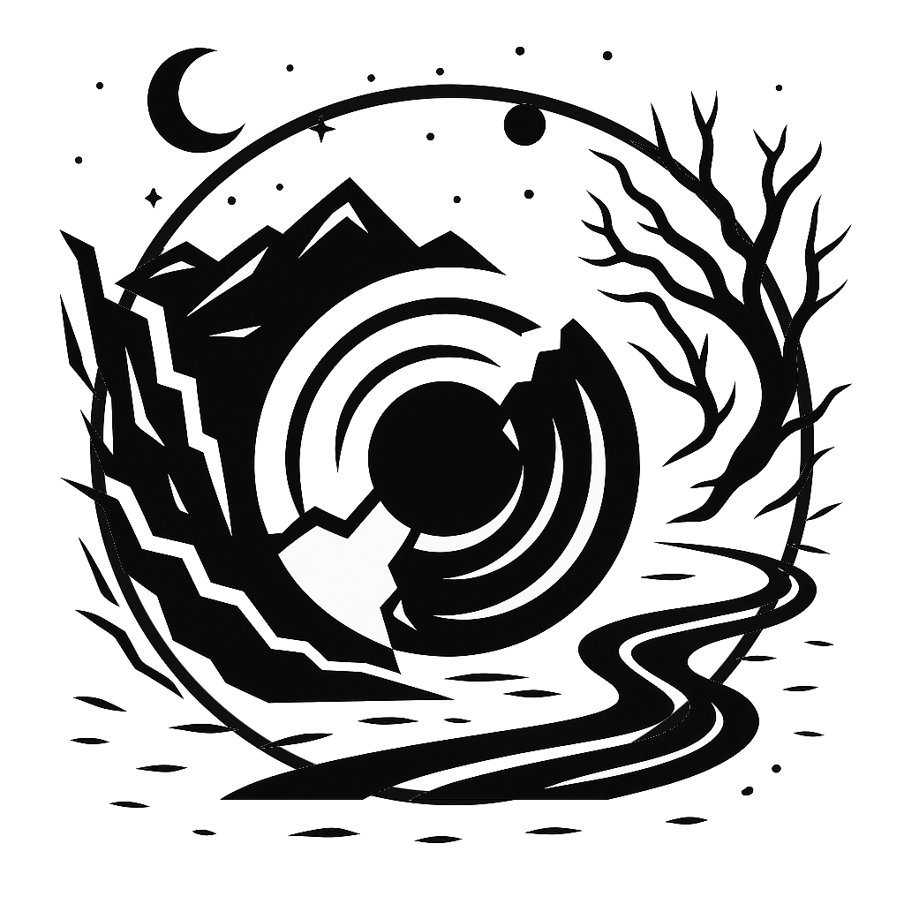

# Le Gouffre d'Absyr

{ width="80" }

> [!REGLE] Concept abordé
> Absurdité, quête de sens, confrontation à l'irrationnel.
> Problématique centrale : comment continuer à vivre et à agir dans
> un monde dépourvu de sens objectif ? Raisonnement existentiel,
> tragique, lucide. Concepts associés : révolte, nihilisme, liberté,
> lucidité, répétition.

## Philosophes associés

Albert Camus y installe l'Homme absurde, Sisyphe, la révolte contre
l'absurde. Friedrich Nietzsche apporte la mort de Dieu, l'éternel
retour, le surhumain. Jean-Paul Sartre y ajoute l'angoisse
existentielle et l'idée d'un monde absurde dès le départ, sur lequel
le projet humain vient s'inscrire.

> [!MJ] Nuance sur Kierkegaard
> Kierkegaard est parfois cité comme référence pour ce quartier, mais
> son propre sujet, dans *Crainte et Tremblement*, est le paradoxe de
> la foi, pas l'absurde en tant que tel. Le lien tient malgré tout :
> Camus discute explicitement le « saut » de Kierkegaard dans *Le
> Mythe de Sisyphe*, et le rejette comme une forme de suicide
> philosophique. Kierkegaard éclaire donc ce quartier par le débat
> que Camus a lui-même engagé avec lui, pas parce qu'il serait
> absurdiste.

## Ce que ça donne en jeu

Ce quartier est instable, brumeux ; le sol s'y dérobe et les
bâtiments défient la logique. Les habitants semblent répéter des
gestes sans fin ou poser les mêmes questions à voix basse. On y perd
le nord, le temps, et parfois l'envie. Pourtant, ceux qui le
traversent y trouvent une force nouvelle : la capacité d'agir sans
illusion, avec lucidité. Une mission peut sembler dépourvue de tout
sens, un événement peut se répéter jusqu'à ce qu'un joueur refuse de
lui donner une justification de plus, un PNJ peut perdre tout espoir
et forcer les autres à réagir face au vide. Ce qui compte alors,
c'est d'agir non par croyance, mais par décision libre.

## Questions à poser à la table

Peut-on créer du sens dans un monde qui n'en offre pas ? La
conscience de l'absurde rend-elle libre ou impuissant ? Faut-il
continuer à agir même si tout semble inutile ? Est-il plus courageux
de croire ou de douter ?
