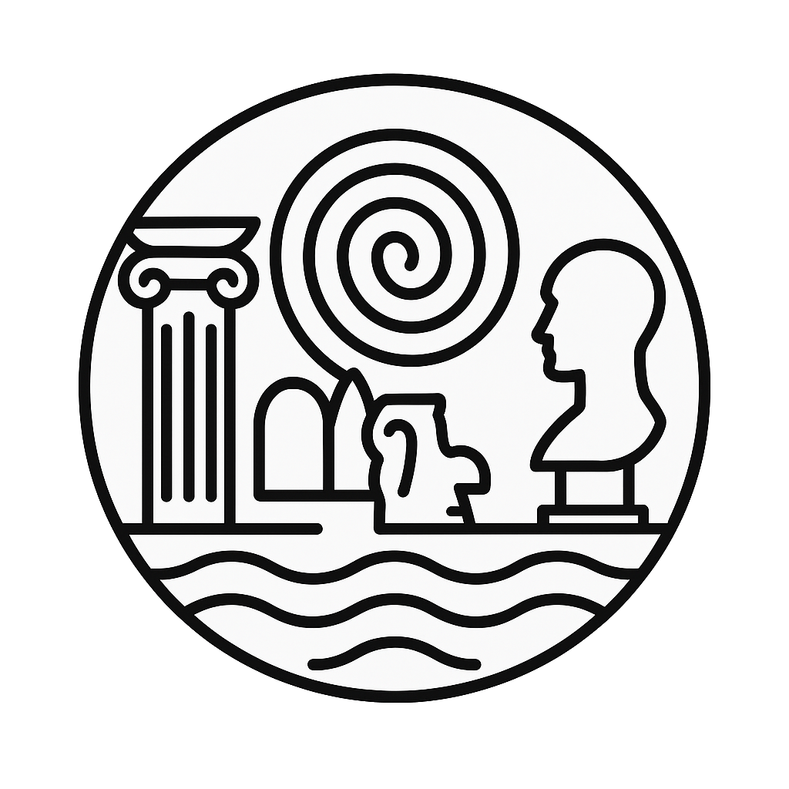

# Le Labyrinthe des Identités

{ width="80" }

> [!REGLE] Concept abordé
> Identité et changement. Problématique centrale : une chose
> demeure-t-elle la même lorsque toutes ses parties sont changées ?
> Raisonnement ontologique et métaphysique. Concepts associés :
> mémoire, continuité, authenticité, altérité.

## Philosophes associés

Plutarque mentionne le premier ce paradoxe, dans la *Vie de Thésée*.
Thomas Hobbes en ajoute une variante : si l'on reconstruit un bateau
avec les anciennes planches qu'on avait jetées, lequel des deux
navires est le vrai ? Paul Ricœur distingue plus tard l'*ipséité* de
la *mêmeté*, le soi vécu du soi reconstruit. Derek Parfit, enfin,
pense l'identité personnelle comme une continuité psychologique, non
comme une continuité matérielle.

## Ce que ça donne en jeu

Dans ce quartier, tout se transforme lentement mais irrémédiablement.
Les bâtiments changent de forme, les souvenirs se réécrivent, les
noms se perdent ou se dédoublent. Le joueur entre dans un monde
fluide, où même son personnage pourrait ne plus être ce qu'il
croyait. Des épreuves de transformation peuvent lui faire perdre des
souvenirs, des traits physiques, ou lui donner une identité nouvelle.
Un objet qui change de forme à chaque session garde-t-il encore sa
signification ? Des PNJ peuvent prétendre être les mêmes malgré un
changement radical de corps, de rôle ou de souvenir, ce qui ouvre sur
un dilemme classique du quartier : sauver une personne altérée mais
fidèle à ses idées, ou une autre inchangée mais devenue hostile.

## Questions à poser à la table

Qu'est-ce qui fait que tu es encore toi ? Si l'on remplace
progressivement toutes tes convictions, es-tu encore le même
personnage ? L'histoire que l'on raconte d'une chose a-t-elle plus de
poids que sa réalité physique ? Peut-on reconstruire une personne à
partir de souvenirs seuls ?
